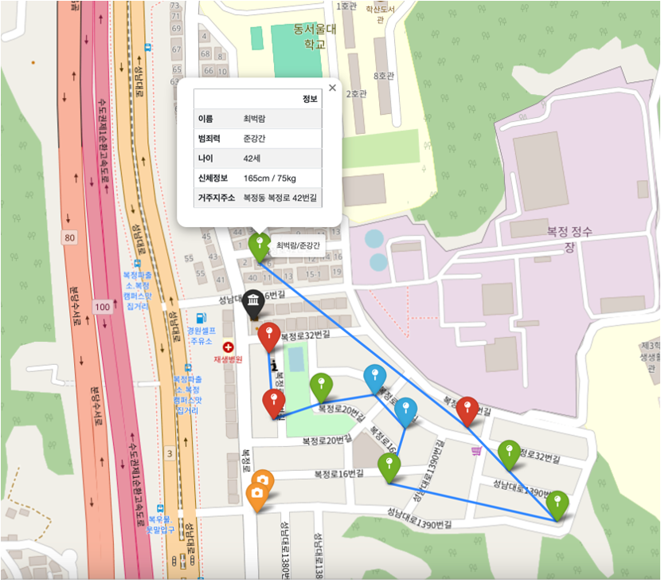

# 성범죄자 알림e를 활용한 성범죄지역 순찰노선 그리기 및 예방 대책
  

## 프로젝트 소개
* 경찰안보학과-공개정보활용및분석 수업 팀프로젝트 (2019년 2학기)
* 주제 : 여성가족부 성범죄자 신상정보알림e/성범죄지역 순찰노선 그리기,예방 대책 발표

 

## 기술 스택
| Python | Jupyter Notebook |
| :----: | :--------------: |
|   |       |
 

## 구현 기능
* 지도 상 성범죄자 거주지 Marker 표시
* 각 Marker를 기준으로 최적으로 순찰노선 Line으로 시각화

 

## 배운 점 & 아쉬운 점
- Python을 배운 후, 처음으로 Python을 사용한 프로젝트라 고급 기술을 활용하지 못했지만 시각화 라이브러를 사용하여 결과물을 도출하여 A+를 받았다!
- 아쉬운 점 : 대규모 데이터셋을 사용할 수 있는 코드로 디벨롭이 필요함. 열심히 배우자~!
